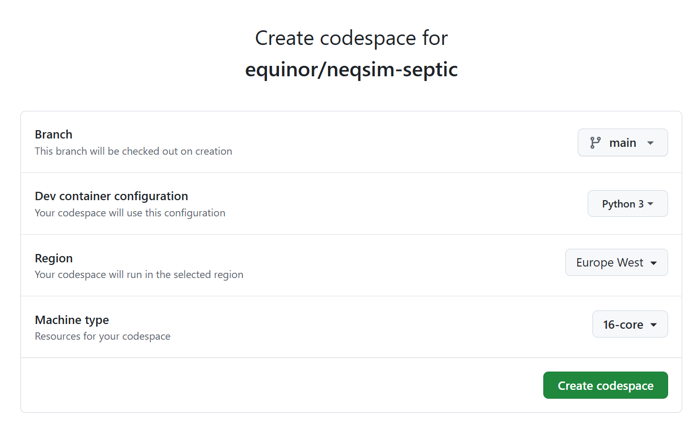

[](https://snyk.io/test/github/equinor/neqsim)

# Neqsim-Native

The project compiles NeqSim java process simulation models into a shared library using GraalVM. This native image can be used directly or integrated into C/C++ programs, making it possible to implement it in process control systems with robust process simulation capabilities.

# Releases
For releases with binary binary files, see:
https://github.com/equinor/neqsim-native/releases/

# Use in Visual Studio
See: example folder.

# Testing and documentation
See: https://github.com/equinor/neqsim-native/tree/main/java_graal/src/test/java/neqsim

# NeqSim introduction
NeqSim is the main part of the [NeqSim project](https://equinor.github.io/neqsimhome/). NeqSim (Non-Equilibrium Simulator) is a Java library for estimating fluid properties and process design.
The basis for NeqSim is a library of fundamental mathematical models related to phase behavior and physical properties of fluids.  NeqSim is easilly extended with new models. NeqSim development was initiated at the [Norwegian University of Science and Technology (NTNU)](https://www.ntnu.edu/employees/even.solbraa).

## Table of Contents

- [Introduction](#introduction)
- [Features](#features)
- [Requirements](#requirements)
- [Installation](#installation)
- [Building the Native Image](#building-the-native-image)
- [Usage](#usage)
- [Project Structure](#project-structure)
- [Contributing](#contributing)
- [License](#license)
- [Contact](#contact)

## Introduction

NeqSim Native leverages GraalVM to compile NeqSim simulation models into a native executable or shared library. This project enables integration of complex simulation models into applications written in languages such as C and C++, which is particularly useful in process control systems and other performance-critical applications.

## Features

- **Native Compilation:** Converts Java-based NeqSim models into native executables or shared libraries.
- **GraalVM Integration:** Uses GraalVM's native-image capabilities for improved performance and reduced startup time.
- **C/C++ Integration:** Provides native libraries that can be easily integrated into C/C++ projects.
- **Process Control Applications:** Ideal for embedding simulation models into real-time process control systems.

## Requirements

- **GraalVM:** Version compatible with native-image (e.g., GraalVM 22.x or later).
- **Build Tools:** Maven (or Gradle, if preferred) for building the project.
- **Git:** For cloning the repository.
- **Java:** JDK version supported by your chosen GraalVM distribution.

## Installation

### 1. Clone the Repository

Clone the main neqsim-native repository:

```
git clone https://github.com/equinor/neqsim-native.git
```


Navigate to the java_graal directory which contains the NeqSim process models and build configuration:

```
cd neqsim-native/java_graal
```

## Automated Build Process
This repository includes an automated build process implemented with GitHub Actions. The workflow, named Create release (draft), is designed to compile the native library on Windows and create a draft release containing the build artifacts.

Workflow Overview
* Trigger: The workflow is manually triggered using workflow_dispatch.
* Job: The compile_dll job runs on windows-latest.

Steps:
* Checkout: The project is checked out using the official GitHub Actions checkout.
* Setup GraalVM: GraalVM CE 23 is installed with the native-image component.
* Verification: The workflow prints the native-image version to verify installation.
* Local Installation: It installs the neqsim-3.0.18.jar locally using Maven.
* Build: The project is built using Maven with the native profile enabled.
* Staging: The output artifacts (.dll, .h, .lib files) are copied to a staging directory.
* Draft Release: A draft release is created with the staged artifacts attached.

2. Build the Project manually
Ensure your environment is configured with the appropriate GraalVM. Then, build the project using Maven:

```
mvn clean package
```

This command will compile the simulation models and package them into a JAR file.

Building the Native Image
After building the project, use the GraalVM native-image tool to generate the native executable or shared library.

For example, to create a native executable:

```
native-image --no-fallback -cp target/your-jar-name.jar
```

For building a shared library, adjust the native-image command with appropriate flags (refer to the GraalVM documentation for details).

Usage
Integrating with C/C++ Projects
Once the native executable or shared library is built, it can be integrated into your C/C++ projects:

Include the Headers: Provide any necessary headers or API documentation generated as part of the build process.
Link the Library: Add the native shared library to your linker settings.
Call the Functions: Use the provided API to invoke NeqSim simulation functions directly from your application.
Example (Pseudo-Code):

c
```
#include "neqsim_native.h"

int main() {
    // Initialize the NeqSim simulation model
    neqsim_initialize();

    // Run the simulation
    double result = neqsim_run_simulation(...);

    // Process the result
    printf("Simulation result: %f\n", result);

    // Clean up resources
    neqsim_cleanup();
    return 0;
}
```

Ensure that the header and function names match those generated during the native image build process.

Project Structure
graphql
Kopier
neqsim-native/
├── java_graal/              # Contains NeqSim process models and GraalVM build configurations
│   ├── src/                # Source code for NeqSim simulation models
│   ├── pom.xml             # Maven configuration file
│   └── README.md           # Additional documentation specific to Java/GraalVM build
├── docs/                   # Project documentation (if any)
└── README.md               # This file
Contributing
Contributions to NeqSim Native are welcome! If you have suggestions, bug fixes, or improvements:

Fork the repository.
Create a feature branch.
Commit your changes.
Submit a pull request.
For major changes, please open an issue first to discuss what you would like to change.

License
This project is licensed under the MIT License.

Contact
For any questions, feedback, or further assistance, please contact the project maintainers or open an issue on GitHub.


