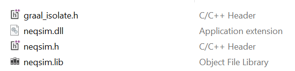

[](https://github.com/equinor/neqsim-native/actions/workflows/verify_build.yml)
[](https://snyk.io/test/github/equinor/neqsim)

# Neqsim-Native

The project compiles NeqSim process simulation models into a shared library using GraalVM. This native image can be used directly or integrated into C/C++ programs, making it possible to implement it in process control systems with robust process simulation capabilities.

Process models can be written in **Java** or **Python** (via GraalPy). Both approaches produce the same kind of native shared library — the caller (C/C++, MATLAB, etc.) cannot tell which language was used. The default build includes Java models only; Python support is available as an opt-in build option.

NeqSim is the main part of the [NeqSim project](https://equinor.github.io/neqsimhome/). NeqSim (Non-Equilibrium Simulator) is a Java library for estimating fluid properties and process design. It is built on a library of fundamental mathematical models related to phase behavior and physical properties of fluids. NeqSim is easily extended with new models. Development was initiated at the [Norwegian University of Science and Technology (NTNU)](https://www.ntnu.edu/employees/even.solbraa).

## Table of Contents

- [Releases](#releases)
- [Features](#features)
- [Requirements](#requirements)
- [Installation](#installation)
- [Automated Build Process](#automated-build-process)
- [Creating a Release](#creating-a-release)
- [Building Locally](#building-locally)
- [Adding a New Process Model](#adding-a-new-process-model)
- [Using the DLL from C/C++](#using-the-dll-from-cc)
- [Documentation](#documentation)
- [Unit Testing](#unit-testing)
- [Project Structure](#project-structure)
- [Contributing](#contributing)
- [License](#license)

## Releases

Download pre-built binaries from the [Releases page](https://github.com/equinor/neqsim-native/releases/).

The **default** release includes Java process models only (no Python). Python (GraalPy) support can optionally be included at release time.

### Default builds (no Python) — always included

| Platform | Archive |
|---|---|
| Linux x86-64 | `neqsim-linux-x64.zip` |
| Windows x86-64 | `neqsim-windows-x64.zip` |
| macOS ARM64 | `neqsim-macos-arm64.zip` |

### With Python builds — optional

| Platform | Archive |
|---|---|
| Linux x86-64 | `neqsim-linux-x64-python.zip` |
| Windows x86-64 | `neqsim-windows-x64-python.zip` |

### 32-bit Windows — always included

| Platform | Archive |
|---|---|
| Windows x86 (32-bit) | `neqsim-windows-x86.zip` |

The 32-bit package contains a thin stub DLL that forwards calls over TCP to a 64-bit server EXE. See [stub32/README.md](stub32/README.md) for details.

### Binary size optimization

Release binaries are compressed with [UPX](https://upx.github.io/) (`--best --lzma`) to reduce download size by ~50%. This is applied automatically by the CI workflow to:
- 64-bit shared libraries (Linux `.so`, Windows `.dll`)

macOS `.dylib` files are **not** compressed — UPX does not support Mach-O shared libraries.

The compressed binaries decompress transparently at load time; no extra steps are needed by the user.

## Use in Visual Studio

See the [example](example/) folder for sample C++ projects. Needed files:



## 32-bit Windows Support

For 32-bit applications, a special package is available. It contains a thin 32-bit stub DLL that forwards calls over TCP to a 64-bit server process. The stub exports functions with the same names; however, `calcWaterDewPoint` and `calcWaterInGas` use output-pointer signatures in the stub (see [stub32/neqsim_stub.h](stub32/neqsim_stub.h)).

See [stub32/README.md](stub32/README.md) for full documentation, usage examples, and build instructions.

## Documentation

Method documentation and input/output parameters are described in the [API documentation](https://github.com/equinor/neqsim-native/blob/main/doc/README.md).

- **[Java process guide](doc/java-processes.md)** — step-by-step guide for adding Java models
- **[Python process guide](doc/python-processes.md)** — step-by-step guide for adding Python models

## Unit Testing

Unit testing is done as part of the build process.
Tests can be seen here: https://github.com/equinor/neqsim-native/tree/main/java_graal/src/test/java/neqsim

## Features

- **Native Compilation:** Converts Java-based NeqSim models into native executables or shared libraries.
- **GraalVM Integration:** Uses GraalVM's `native-image` capabilities for improved performance and reduced startup time.
- **Python Support (GraalPy):** Write process models in Python using neqsim's Java API via `java.type()` interop — no JVM bridge required.
- **C/C++ Integration:** Provides native libraries that can be easily integrated into C/C++ projects.
- **Cross-Platform:** Builds for Linux, Windows, and macOS.
- **Process Control Applications:** Ideal for embedding simulation models into real-time process control systems.

## Requirements

- **GraalVM JDK 25+** — includes `native-image` (download from [graalvm.org](https://www.graalvm.org/))
- **Maven** — included via the Maven wrapper (`mvnw` / `mvnw.cmd`)
- **Git** — for cloning the repository
- **Visual Studio Build Tools** (Windows only) — for the MSVC toolchain used by `native-image`

## Installation

### 1. Clone the Repository

Clone the main neqsim-native repository:

```
git clone https://github.com/equinor/neqsim-native.git
```

Navigate to the java_graal directory which contains the NeqSim process models and build configuration:

```
cd neqsim-native/java_graal
```

## Automated Build Process

This repository includes automated CI/CD workflows via GitHub Actions:

| Workflow | Purpose | Trigger |
|---|---|---|
| **Create release (draft)** | Builds default + optional with-python shared libraries for Linux, Windows, and macOS, publishes as draft release | Manual (`workflow_dispatch`) |
| **Verify Build** | Runs unit tests (Temurin JDK) on Windows + Linux, builds the 32-bit stub DLL | Push / PR to `main` |
| **Integration Tests** | Runs all tests including `@Tag("integration")` Python model tests | Manual (`workflow_dispatch`) |

Both workflows use **GraalVM 25.0.1** with the `native-image` component. The Maven build handles everything — there is no need to invoke `native-image` manually.

## Creating a Release

Releases are created via the **"Multi Platform Release"** workflow in GitHub Actions.

### Steps

1. Go to **Actions** → **Multi Platform Release** → **Run workflow**
2. Fill in the inputs:

   | Input | Description |
   |-------|-------------|
   | **Release version** | Semantic version, e.g. `2.1.0` — becomes the Git tag `v2.1.0` |
   | **Include Python (GraalPy) builds?** | Check this box to also produce the with-Python variants (artifact names end in `-python`). Leave unchecked for default-only releases. |

3. Click **Run workflow** and wait for the jobs to finish (~10 min default-only, ~50 min with Python)
4. Go to **Releases** — a **draft** release has been created with all the zip files attached
5. Review the draft, edit the release notes if needed, then **Publish**

### What gets built?

| Include Python? | Artifacts produced | Approx. time |
|:---:|---|---|
| ☐ Unchecked | 3 default zips (Linux, Windows, macOS) + 1 x86 zip (Windows 32-bit) | ~15 min |
| ☑ Checked | 3 default + 2 with-python + 1 x86 zips | ~55 min |

### When to include Python

- **Skip Python** (default) for faster, smaller releases. All `PY_*` functions are still exported but return `quality=0` with a clear error message at runtime. This is recommended for most users.
- **Include Python** when a release specifically needs Python process models (e.g. `PY_run_dewpoint_calculation`). These builds are larger and take longer to compile.

## Building Locally

Ensure [GraalVM JDK 25+](https://www.graalvm.org/) is installed and `JAVA_HOME` points to it.

```bash
cd java_graal

# Default builds (no Python — recommended):
./mvnw -Pnative-linux-lean package               # Linux
mvnw.cmd -Pnative-windows-lean package           # Windows
./mvnw -Pnative-macos-lean package               # macOS

# With Python support (optional, larger and slower to build):
./mvnw -Pnative-linux,with-python package        # Linux
mvnw.cmd -Pnative-windows,with-python package    # Windows
./mvnw -Pnative-macos,with-python package        # macOS
```

Output files appear in `java_graal/target/`:

| File | Description |
|---|---|
| `neqsim.dll` / `neqsim.so` / `neqsim.dylib` | Shared library with all exported models |
| `neqsim.h` | Auto-generated C header with all `@CEntryPoint` functions |
| `graal_isolate.h` | GraalVM isolate type definitions |
| `neqsim.lib` | Windows import library (MSVC linker) |

> **Note:** Default builds include Java models only. With-Python builds include both Java and Python models. In default builds, Python functions (`PY_*`) are still exported but return `quality=0` with an error message at runtime.

## Adding a New Process Model

Process models can be written in **Java** or **Python** (via GraalPy). Both compile into the same shared library.

### Adding a Java Process Model

For a complete step-by-step guide with full code examples, see **[doc/java-processes.md](doc/java-processes.md)**.

#### Quick checklist

- [ ] **Create the model class** in `java_graal/src/main/java/neqsim/process/<name>/`
  - Include a `@CEntryPoint` method with `CDoublePointer` / `CIntPointer` output parameters
  - Use a lock object you `synchronize` on
- [ ] **Add unit tests** in `java_graal/src/test/java/neqsim/process/<name>/`
- [ ] **Update `reflect-config.json`** if your model uses reflection-based class loading
- [ ] **doc/README.md** — API parameter table
- [ ] *(Optional)* **32-bit stub support** — see [stub32/README.md](stub32/README.md) and update `neqsim_stub.h`, `neqsim_stub.c`, `neqsim_stub.def`, `NeqSimPipeServer.java`, `ProcessDispatcher.java`

### Adding a Python Process Model

Python models require far fewer files — just the `.py` script and a thin Java wrapper (~40 lines). All GraalPy boilerplate is handled by the shared `PythonProcessRunner` class.

See **[doc/python-processes.md](doc/python-processes.md)** for a complete step-by-step guide with examples.

#### Quick checklist

- [ ] **Python script** in `java_graal/src/main/resources/python/<model>.py`
- [ ] **Java wrapper** in `java_graal/src/main/java/neqsim/process/python/Python<Name>.java`
- [ ] **Unit test** in `java_graal/src/test/java/neqsim/process/python/`
- [ ] **doc/README.md** — API parameter table
- [ ] *(Optional)* **32-bit stub support** — see [stub32/README.md](stub32/README.md)

## Using the DLL from C/C++

Every call follows the same 3-step pattern, regardless of whether the underlying model is Java or Python:

```c
#include "neqsim.h"

int main() {
    /* 1. Create the GraalVM isolate (once) */
    graal_isolate_t* isolate = NULL;
    graal_isolatethread_t* thread = NULL;
    graal_create_isolate(NULL, &isolate, &thread);

    /* 2. Call any exported function */
    double dew_point = calcWaterDewPoint(thread, 50.0, 100.0);
    printf("Water dew point: %.2f C\n", dew_point);

    /* 3. Tear down the isolate (when done) */
    graal_tear_down_isolate(thread);
    return 0;
}
```

See the [example/](example/) folder for complete C++ projects on both Windows and Linux.

## Project Structure

```
neqsim-native/
├── java_graal/              # NeqSim process models and GraalVM build configurations
│   ├── src/
│   │   ├── main/java/neqsim/
│   │   │   ├── process/     # Process models (Java + Python wrappers)
│   │   │   ├── server/      # IPC server for 32-bit stub
│   │   │   └── util/        # Utility classes
│   │   ├── main/resources/
│   │   │   ├── python/      # Python process models (GraalPy)
│   │   │   └── META-INF/    # Native-image configuration
│   │   └── test/            # Unit tests
│   ├── pom.xml              # Maven configuration (dependencies + native profiles)
│   └── README.md            # Build documentation
├── stub32/                  # 32-bit stub DLL + server (for 32-bit applications)
│   ├── neqsim_stub.c        # Stub DLL source (TCP forwarder)
│   ├── neqsim_stub.h        # Public API header (drop-in for neqsim.h)
│   ├── neqsim_stub.def      # DLL export definitions
│   ├── build.bat            # Build script
│   └── README.md            # 32-bit architecture documentation
├── example/                 # C/C++ usage examples (windows + linux)
├── doc/                     # API parameter documentation + guides
│   ├── README.md            # Function-level API docs (inputs/outputs)
│   ├── java-processes.md    # Step-by-step guide for Java models
│   └── python-processes.md  # Step-by-step guide for Python models
├── .github/workflows/       # CI/CD workflows
└── README.md                # This file
```

## Contributing

Contributions to NeqSim Native are welcome! If you have suggestions, bug fixes, or improvements:

1. Fork the repository.
2. Create a feature branch.
3. Commit your changes.
4. Submit a pull request.

For major changes, please open an issue first to discuss what you would like to change.

## License

This project is licensed under the MIT License.
